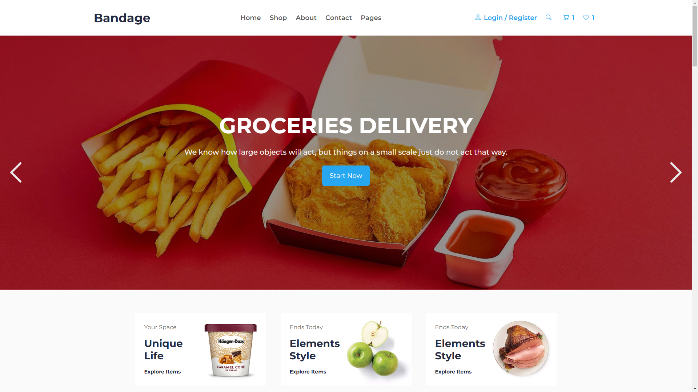

# Desafio Página Web Compass

Este projeto é uma aplicação web desenvolvida como parte de um desafio da **Compass.uol**. A aplicação tem como objetivo demonstrar habilidades em **desenvolvimento web**, incluindo HTML, CSS e JavaScript.

## Preview

## Tecnologias Utilizadas

- HTML5
- CSS3
- JavaScript

## Link

https://arthurz7.github.io/desafio-pagina-web-compass/

